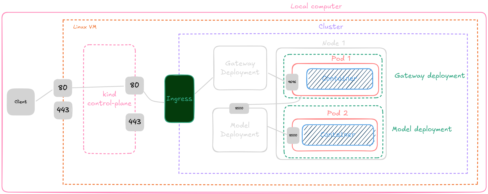

#### [DataTalks.Club](https://datatalks.club)'s Capstone 2 project by [Alexander D. Rios](https://linktr.ee/aletbm)
# 🌋 Natural Language Processing with Disaster Tweets
</img>
<cite style="font-size:10px">Source: [EarthDailyAnalytics](https://earthdaily.com/industry/natural-disaster-risk-management/)</cite>

<a href="https://www.kaggle.com/code/aletbm/nlp-with-disaster-tweets" target="_blank"></a><a href="https://colab.research.google.com/drive/1ljQsYggPPQEUjZbLjTANhgEF9vZeCl9L?usp=sharing" target="_parent"></a><a href="https://disastertweetsclassification.streamlit.app" target="_parent"></a>

This repository was created as part of [the DataTalks.Club's Machine Learning Zoomcamp](https://github.com/alexeygrigorev) by [Alexey Grigorev](https://github.com/alexeygrigorev).

This project has been submitted as the Capstone 1 project for the course.

---
## Overview
Twitter has become an important communication channel in times of emergency. The ubiquitousness of smartphones enables people to announce an emergency they’re observing in real-time. Because of this, more agencies are interested in programatically monitoring Twitter (i.e. disaster relief organizations and news agencies).

But, it’s not always clear whether a person’s words are actually announcing a disaster. Take this example:


The author explicitly uses the word “ABLAZE” but means it metaphorically. This is clear to a human right away, especially with the visual aid. But it’s less clear to a machine.
    
In this competition, we’re challenged to build a machine learning model that **predicts which Tweets are about real disasters and which one’s aren’t**. We’ll have access to a dataset of **10,000 tweets** that were hand classified.

> Disclaimer: The dataset for this competition contains text that may be considered profane, vulgar, or offensive.

## Acknowledgments
This dataset was created by the company figure-eight and originally shared on their [‘Data For Everyone’ website here](https://www.figure-eight.com/data-for-everyone/).

Tweet source: [https://twitter.com/AnyOtherAnnaK/status/629195955506708480](https://twitter.com/AnyOtherAnnaK/status/629195955506708480)

### What am I predicting?
You are predicting whether a given tweet is about a real disaster or not. If so, predict a 1. If not, predict a 0.

### Kaggle competition
    
You can find the competition in the following link: [https://www.kaggle.com/competitions/nlp-getting-started](https://www.kaggle.com/competitions/nlp-getting-started)

This particular challenge is perfect for data scientists looking to get started with Natural Language Processing.

---
# Directory structure

### 📂 NLP_with_Disaster_Tweets_Capstone_2
* 📄 [README.md](https://github.com/aletbm/NLP_with_Disaster_Tweets/blob/main/README.md)
* 📄 [Pipfile](https://github.com/aletbm/NLP_with_Disaster_Tweets/blob/main/Pipfile)
* 📄 [Pipfile.lock](https://github.com/aletbm/NLP_with_Disaster_Tweets/blob/main/Pipfile.lock)
* 📂 [analysis](https://github.com/aletbm/NLP_with_Disaster_Tweets/tree/main/analysis)
    * 📊 [nlp-with-disaster-tweets.ipynb](https://github.com/aletbm/NLP_with_Disaster_Tweets/blob/main/analysis/nlp-with-disaster-tweets.ipynb)
    * 📊 [NLP_with_Disaster_Tweets-Colab.ipynb](https://github.com/aletbm/NLP_with_Disaster_Tweets/blob/main/analysis/NLP_with_Disaster_Tweets-Colab.ipynb)
    * 📖 [NLP_with_Disaster_Tweets-Colab.pdf](https://github.com/aletbm/NLP_with_Disaster_Tweets/blob/main/analysis/NLP_with_Disaster_Tweets-Colab.pdf)
    * 📊 [test_deploy.ipynb](https://github.com/aletbm/NLP_with_Disaster_Tweets/blob/main/analysis/test_deploy.ipynb)
* 📂 [dataset](https://github.com/aletbm/NLP_with_Disaster_Tweets/tree/main/dataset)
    * 📂 [479k-english-words](https://github.com/aletbm/NLP_with_Disaster_Tweets/tree/main/dataset/479k-english-words)
        * 🗄️ [english_words_479k.txt](https://github.com/aletbm/NLP_with_Disaster_Tweets/blob/main/dataset/479k-english-words/english_words_479k.txt)
    * 📂 [english-word-frequency](https://github.com/aletbm/NLP_with_Disaster_Tweets/tree/main/dataset/english-word-frequency)
        * 🗄️ [unigram_freq.csv](https://github.com/aletbm/NLP_with_Disaster_Tweets/blob/main/dataset/english-word-frequency/unigram_freq.csv)
    * 📂 [nlp-getting-started](https://github.com/aletbm/NLP_with_Disaster_Tweets/tree/main/dataset/nlp-getting-started)
        * 🗄️ [sample_submission.csv](https://github.com/aletbm/NLP_with_Disaster_Tweets/blob/main/dataset/nlp-getting-started/sample_submission.csv)
        * 🗄️ [test.csv](https://github.com/aletbm/NLP_with_Disaster_Tweets/blob/main/dataset/nlp-getting-started/test.csv)
        * 🗄️ [train.csv](https://github.com/aletbm/NLP_with_Disaster_Tweets/blob/main/dataset/nlp-getting-started/train.csv)
* 📂 [etc](https://github.com/aletbm/NLP_with_Disaster_Tweets/tree/main/etc)
    * 📄 [deploy.sh](https://github.com/aletbm/NLP_with_Disaster_Tweets/blob/main/etc/deploy.sh)
    * ⚙️ [gateway-deployment-service.yaml](https://github.com/aletbm/NLP_with_Disaster_Tweets/blob/main/etc/gateway-deployment-service.yaml)
    * ⚙️ [gateway-deployment.yaml](https://github.com/aletbm/NLP_with_Disaster_Tweets/blob/main/etc/gateway-deployment.yaml)
    * 🐋 [gateway.dockerfile](https://github.com/aletbm/NLP_with_Disaster_Tweets/blob/main/etc/gateway.dockerfile)
    * ⚙️ [kind-config.yaml](https://github.com/aletbm/NLP_with_Disaster_Tweets/blob/main/etc/kind-config.yaml)
    * ⚙️ [metallb-configmap.yaml](https://github.com/aletbm/NLP_with_Disaster_Tweets/blob/main/etc/metallb-configmap.yaml)
    * ⚙️ [model-deployment.yaml](https://github.com/aletbm/NLP_with_Disaster_Tweets/blob/main/etc/model-deployment.yaml)
    * ⚙️ [model-service.yaml](https://github.com/aletbm/NLP_with_Disaster_Tweets/blob/main/etc/model-service.yaml)
    * ⚙️ [nginx-ingress.yaml](https://github.com/aletbm/NLP_with_Disaster_Tweets/blob/main/etc/nginx-ingress.yaml)
    * 🐋 [serving.dockerfile](https://github.com/aletbm/NLP_with_Disaster_Tweets/blob/main/etc/serving.dockerfile)
* 📂 [models](https://github.com/aletbm/NLP_with_Disaster_Tweets/tree/main/models)
    * 🤖 [model_base.h5](https://github.com/aletbm/NLP_with_Disaster_Tweets/blob/main/models/model_base.h5)
    * 🤖 [tokenizer.bin](https://github.com/aletbm/NLP_with_Disaster_Tweets/blob/main/models/tokenizer.bin)
* 📂 [scripts](https://github.com/aletbm/NLP_with_Disaster_Tweets/tree/main/scripts)
    * 🐍 [load_data.py](https://github.com/aletbm/NLP_with_Disaster_Tweets/blob/main/scripts/load_data.py)
    * 🐍 [model_conversor.py](https://github.com/aletbm/NLP_with_Disaster_Tweets/blob/main/scripts/model_conversor.py)
    * 🐍 [model_serving.py](https://github.com/aletbm/NLP_with_Disaster_Tweets/blob/main/scripts/model_serving.py)
    * 🐍 [test.py](https://github.com/aletbm/NLP_with_Disaster_Tweets/blob/main/scripts/test.py)
    * 🐍 [train.py](https://github.com/aletbm/NLP_with_Disaster_Tweets/blob/main/scripts/train.py)
    * 🐍 [utils.py](https://github.com/aletbm/NLP_with_Disaster_Tweets/blob/main/scripts/utils.py)
    * 📂 [disaster_tweets_model](https://github.com/aletbm/NLP_with_Disaster_Tweets/tree/main/scripts/disaster_tweets_model)
        * 📄 [fingerprint.pb](https://github.com/aletbm/NLP_with_Disaster_Tweets/blob/main/scripts/disaster_tweets_model/fingerprint.pb)
        * 📄 [saved_model.pb](https://github.com/aletbm/NLP_with_Disaster_Tweets/blob/main/scripts/disaster_tweets_model/saved_model.pb)
        * 📂  [variables](https://github.com/aletbm/NLP_with_Disaster_Tweets/tree/main/scripts/disaster_tweets_model/variables)
            * 📄 [variables.data-00000-of-00001](https://github.com/aletbm/NLP_with_Disaster_Tweets/blob/main/scripts/disaster_tweets_model/variables/variables.data-00000-of-00001)
            * 📄 [variables.index](https://github.com/aletbm/NLP_with_Disaster_Tweets/blob/main/scripts/disaster_tweets_model/variables/variables.index)
* 📂  [streamlit_app](https://github.com/aletbm/NLP_with_Disaster_Tweets/tree/main/streamlit_app)
    * 🐍 [my_app.py](https://github.com/aletbm/NLP_with_Disaster_Tweets/blob/main/streamlit_app/my_app.py)
    * 📄 [requirements.txt](https://github.com/aletbm/NLP_with_Disaster_Tweets/blob/main/streamlit_app/requirements.txt)
    * 🗄️ [train_clean.csv](https://github.com/aletbm/NLP_with_Disaster_Tweets/blob/main/streamlit_app/train_clean.csv)

---
# Downloading the dataset

In this project, I used the following dataset: [Natural Language Processing with Disaster Tweets](https://www.kaggle.com/competitions/nlp-getting-started)


You can download it with the following code:

```
!pip install kagglehub

import kagglehub
kagglehub.login()

nlp_getting_started_path = kagglehub.competition_download('nlp-getting-started')
rtatman_english_word_frequency_path = kagglehub.dataset_download('rtatman/english-word-frequency')
yk1598_479k_english_words_path = kagglehub.dataset_download('yk1598/479k-english-words')
keras_bert_keras_bert_small_en_uncased_2_path = kagglehub.model_download('keras/bert/Keras/bert_small_en_uncased/2')

print('Data source import complete.')
```
You need to log in with your credentials or username and password. For more help, refer to the [KaggleHub repository](https://github.com/Kaggle/kagglehub)

## Dataset Description
The dataset for training contains 7613 records about tweets.

Each sample in the train and test set has the following information:

+ The `text` of a tweet
+ A `keyword` from that tweet (although this may be blank!)
+ The `location` the tweet was sent from (may also be blank)

## Evaluation
Submissions are evaluated using F1 between the predicted and expected answers.
F1 is calculated as follows:

$ F_1=2∗\frac{precision∗recall}{precision+recall}$

where:
+ $precision=\frac{TP}{TP+FP}$
+ $recall=\frac{TP}{TP+FN}$

and:
```
True Positive [TP] = your prediction is 1, and the ground truth is also 1 - you predicted a positive and that's true!
False Positive [FP] = your prediction is 1, and the ground truth is 0 - you predicted a positive, and that's false.
False Negative [FN] = your prediction is 0, and the ground truth is 1 - you predicted a negative, and that's false.
```

## Dataset analysis and Training models

The dataset analysis and the models training were conducted in Jupyter Notebook. You can find in the file named [nlp-with-disaster-tweets.ipynb](https://github.com/aletbm/NLP_with_Disaster_Tweets/blob/main/analysis/nlp-with-disaster-tweets.ipynb).

The training script is available in the [train.py](https://github.com/aletbm/NLP_with_Disaster_Tweets/blob/main/scripts/train.py) script.

To deployment I used a model trained for classification named [model_base.h5](https://github.com/aletbm/NLP_with_Disaster_Tweets/blob/main/models/model_base.h5).

---
# Running the project locally

## Using Flask

The script to deploy the model using Flask is [model_serving.py](https://github.com/aletbm/NLP_with_Disaster_Tweets/blob/main/scripts/model_serving.py)

[Pipfile](https://github.com/aletbm/NLP_with_Disaster_Tweets/blob/main/Pipfile) and [Pipfile.lock](https://github.com/aletbm/NLP_with_Disaster_Tweets/blob/main/Pipfile.lock) set up the Pipenv environment.

First, you need to install from [Pipfile](https://github.com/aletbm/NLP_with_Disaster_Tweets/blob/main/Pipfile):
```
pipenv install
```
The virtual environment can be activated by running
```
pipenv shell
```
Once in the virtual enviroment, you can run the following command:
```
python ./scripts/model_serving.py
```
Futhermore, you need to serve the model with the following command:
```
docker run -it --rm -p 8500:8500 -v "$(pwd)/scripts/disaster_tweets_model:/models/disaster_tweets_model/1" -e MODEL_NAME=disaster_tweets_model tensorflow/serving:2.14.0
```
Then, you will be ready to test the model by running the following command:
```
python ./scripts/test.py
```
Don't forget to update the `url` variable in the [test.py](https://github.com/aletbm/NLP_with_Disaster_Tweets/blob/main/scripts/test.py) file to:
```
url = "http://localhost:9696/predict"
```
Also, you must update the host in the [model_serving.py](https://github.com/aletbm/NLP_with_Disaster_Tweets/blob/main/scripts/model_serving.py) file to:
```
host = os.getenv('TF_SERVING_HOST', 'localhost:8500')
```
## Using Waitress as WSGI server

Once in the virtual enviroment, you can run the following commands:
```
waitress-serve --listen=0.0.0.0:9696 scripts.model_serving:app
```
Before that, you need to serve the model using the following command:
```
docker run -it --rm -p 8500:8500 -v "$(pwd)/scripts/disaster_tweets_model:/models/disaster_tweets_model/1" -e MODEL_NAME=disaster_tweets_model tensorflow/serving:2.14.0
```
And then, you can test the model by running the following command:
```
python ./scripts/test.py
```
Don't forget to update the `url` variable in the [test.py](https://github.com/aletbm/NLP_with_Disaster_Tweets/blob/main/scripts/test.py) file to:
```
url = "http://localhost:9696/predict"
```
Also, you must update the host in the [model_serving.py](https://github.com/aletbm/NLP_with_Disaster_Tweets/blob/main/scripts/model_serving.py) file to:
```
host = os.getenv('TF_SERVING_HOST', 'localhost:8500')
```
## Local deployment with Kubernetes, Kind and Docker
To deploy our model with Kubernetes, I aim to ensure that you can create the following structures and connections:


First, you need to build:
+ The TensorFlow Serving image.
+ The Gateway image.

To achieve this, I created two separate Dockerfiles:
+ [serving.dockerfile](https://github.com/aletbm/NLP_with_Disaster_Tweets/blob/main/etc/serving.dockerfile) -- Contains the instruction to serve the TensorFlow model in `saved_model` format ([disaster_tweets_model](https://github.com/aletbm/MySolutions_MLZoomcamp2024_DataTalks.Club/tree/main/NLP_with_Disaster_Tweets_Capstone_2/scripts/disaster_tweets_model)).
+ [gateway.dockerfile](https://github.com/aletbm/NLP_with_Disaster_Tweets/blob/main/etc/gateway.dockerfile) -- Contains the instruction to deploy the [model_serving.py](https://github.com/aletbm/NLP_with_Disaster_Tweets/blob/main/scripts/model_serving.py) algorithm and install its dependencies.

To build them, you can use the following commands:

```
docker build -t tf-serving-disaster-tweets-model -f .etc/serving.dockerfile .

docker build -t serving-gateway-disaster-tweets-model -f ./etc/gateway.dockerfile .
```
You must tag and push them to your repository:
```
docker tag tf-serving-disaster-tweets-model <YOUR_USERNAME>/tf-serving-disaster-tweets-model
docker tag serving-gateway-disaster-tweets-model <YOUR_USERNAME>/serving-gateway-disaster-tweets-model

docker push <YOUR_USERNAME>/tf-serving-disaster-tweets-model:latest
docker push <YOUR_USERNAME>/serving-gateway-disaster-tweets-model:latest
```
You can also pull them from my repository by using the following commands:
```
docker pull aletbm/tf-serving-disaster-tweets-model:latest

docker pull aletbm/serving-gateway-disaster-tweets-model:latest
```
To deploy locally using Docker, you must execute the following commands in two separate terminals:

+ To serve the model:
    ```
    docker run -it --rm -p 8500:8500 tf-serving-disaster-tweets-model:latest
    ```
+ To deploy the gateway:
    ```
    docker run -it --rm -p 9696:9696 serving-gateway-disaster-tweets-model:latest
    ```
Then, you will be ready to test the model by running the following command:
```
python ./scripts/test.py
```
Don't forget to update the `url` variable in the [test.py](https://github.com/aletbm/NLP_with_Disaster_Tweets/blob/main/scripts/test.py) file to:
```
url = "http://localhost:9696/predict"
```
To deploy locally using Kubernetes and Docker, you must replace my Docker username with your Docker username in:

+ The [model-deployment.yaml](https://github.com/aletbm/NLP_with_Disaster_Tweets/blob/main/etc/model-deployment.yaml) file configuration.
    ```
        spec:
        containers:
        - name: tf-serving-disaster-tweets-model
            image: <YOUR_USERNAME>/tf-serving-disaster-tweets-model:latest
            ports:
            - containerPort: 8500
    ```
+ The [gateway-deployment.yaml](https://github.com/aletbm/NLP_with_Disaster_Tweets/blob/main/etc/gateway-deployment.yaml) file configuration.
    ```
    spec:
      containers:
      - name: serving-gateway-disaster-tweets-model
        image: <YOUR_USERNAME>/serving-gateway-disaster-tweets-model:latest
        ports:
        - containerPort: 9696
    ```
Up to this point, you have built and pushed all the necessary images, and all configuration files have been corrected.

>You need to install [Kubernetes](https://kubernetes.io/docs/setup/) and [Kind](https://kind.sigs.k8s.io/docs/user/quick-start/). I won’t explain how to install them, but you can refer to their respective documentation pages.

Now, you need to create a Kubernetes cluster with Kind and apply all configuration files. To do this, you have two options:
+ Do it manually by executing each command individually.
+ Do it automatically by executing the [deploy.sh](https://github.com/aletbm/NLP_with_Disaster_Tweets/blob/main/etc/deploy.sh) script.

Manually, you must to execute the following commands:
```
kind create cluster --config kind-config.yaml

kubectl apply -f https://raw.githubusercontent.com/kubernetes/ingress-nginx/main/deploy/static/provider/kind/deploy.yaml

kubectl apply -f model-deployment.yaml
kubectl apply -f model-service.yaml
kubectl apply -f gateway-deployment.yaml
kubectl apply -f gateway-deployment-service.yaml

kubectl delete -A ValidatingWebhookConfiguration ingress-nginx-admission
kubectl apply -f nginx-ingress.yaml

kubectl apply -f https://raw.githubusercontent.com/metallb/metallb/v0.12.1/manifests/namespace.yaml
kubectl apply -f https://raw.githubusercontent.com/metallb/metallb/v0.12.1/manifests/metallb.yaml
kubectl apply -f metallb-configmap.yaml
kubectl get pods -n metallb-system --watch
```
Automatically, you must to execute the following command in a bash terminal:
```
cd etc

./deploy.sh
```
Once all pods are running, you can test the deployment by running the following command:
```
python ./scripts/test.py
```
Don't forget to update the `url` variable in the [test.py](https://github.com/aletbm/NLP_with_Disaster_Tweets/blob/main/scripts/test.py) file to:
```
url = "http://localhost:80/predict"
```

## Testing the deployment

I’ve included a GIF that shows how to perform a deployment:


# Streamlit App
On the other hand, I developed a very simple app using Streamlit to deploy my model, where you can upload an image and obtain a prediction.

https://github.com/user-attachments/assets/ad2c0160-2af8-4ccc-acbe-bfe2ab0056fc

Here’s the link to my [Streamlit App](https://disastertweetsclassification.streamlit.app).